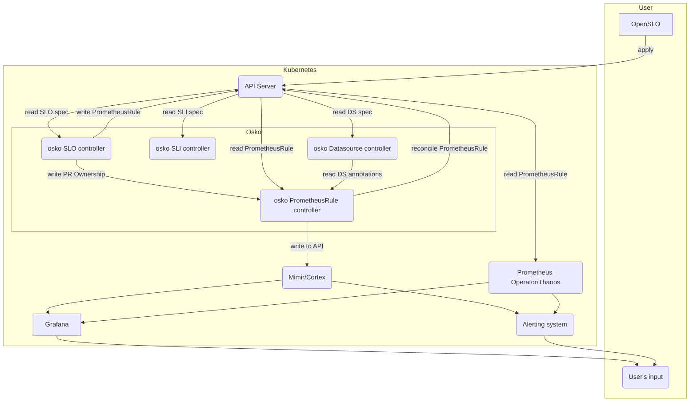

Hi there! Consider this both a test of the Docusaurus blogging feature,
as well as the OSKO team's first introduction.

I am Robin, and together with Patrik Chadima ([@Hy3n4](https://github.com/Hy3n4))
and David Jetelina ([@djetelina](https://github.com/djetelina)) are building `osko`.

## What's osko?

`osko` is a Kubernetes operator that focuses on simplifying the management of everything
SLOs in the Kubernetes ecosystem.

The high-level goals and function of `osko` are:

1. Take inputs in in the form of metrics from supported datasources (Mimir, Prometheus to start off with)
   as defined by [OpenSLO](https://github.com/OpenSLO/OpenSLO)-compatible resources
2. Based on OpenSLO definitions, produce
   [Prometheus recording rules](https://prometheus.io/docs/prometheus/latest/configuration/recording_rules/)
   that will capture the intended availability of the service.
3. Write those Prometheus recording rules in the form of [`PrometheusRule`](https://github.com/prometheus-operator/prometheus-operator/blob/main/pkg/apis/monitoring/v1/prometheusrule_types.go)
   back into the cluster either for:
   - direct consumption by Prometheus/Thanos
   - loading of the rules into Mimir/Cortex using the built-in controller for `PrometheusRule` resources
   - loading of the rules into Mimir using Grafana Agent
   - anything else, depending on your use-case

## Quick diagram of the above

